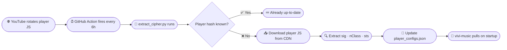

<div align="center">


<br/>

[](https://github.com/ViviMusicGroup/vivi-playerx/commits/main)
[](https://python.org)
[](#)
[](#)

<br/>

> **An autonomous microservice that tracks YouTube's rotating player JS every 6 hours,**  
> **extracts signature deobfuscation configs and throttle bypass keys, and keeps [`vivi-music`](https://github.com/vivizzz007/vivi-music) playback seamless — always.**

<br/>

</div>

---

## ✦ What is vivi-playerx?

YouTube periodically rotates its internal player JavaScript, breaking streaming signature decryption and introducing throttling that makes audio unplayable. **vivi-playerx** solves this autonomously.

It monitors YouTube's player hash rotation, downloads the new JS, reverse-engineers the obfuscation algorithm, and commits the solved mappings — all without any human intervention. The `vivi-music` Android client fetches these configs at startup to decrypt streams in real-time.

---

## ⚡ Feature Highlights

<table>
<tr>
<td width="50%">

### 🔄 Auto-Updating Every 6 Hours
GitHub Actions runs on a schedule, detecting new player hashes and solving their signature algorithms automatically — no manual intervention ever needed.

</td>
<td width="50%">

### 🔐 Signature Deobfuscation
Extracts and solves YouTube's `sig` cipher expression, the cryptographic key needed to unlock age-restricted or protected streams.

</td>
</tr>
<tr>
<td width="50%">

### 🚀 Throttle Bypass (nClass)
Captures the `nClass` transform that YouTube uses to slow down unofficial clients, and neutralizes it so playback stays at full speed.

</td>
<td width="50%">

### 📡 Live Status Dashboard
A deployed status page shows all solved player nodes, solved mapping counts, and system health — in real time.

</td>
</tr>
</table>

---

## ⚙️ How It Works



---

## 📂 Repository Structure

```
vivi-playerx/
├── 📄 player_configs.json          ← Solved signature & throttle bypass database
├── 🐍 extract_cipher.py            ← Extraction & parsing engine
├── 🌐 index.html                   ← Live status dashboard UI
├── 🎨 css/style.css                ← Dashboard styles
├── ⚙️  js/app.js                    ← Dashboard logic
└── 🤖 .github/workflows/update.yml ← Automated 6-hour job
```

---

## 🗄️ Config Schema

Each entry in `player_configs.json` follows this structure:

```jsonc
{
  "schemaVersion": 1,
  "players": {
    "<player_hash>": {
      "sig": "funcName(arg1, arg2, INPUT)",  // Signature deobfuscation expression
      "nClass": "ClassName",                  // Throttle bypass class name
      "sts": 20649,                           // Signature timestamp
      "aliases": []                           // Known equivalent hashes
    }
  }
}
```

---

## 🛡️ Proprietary Notice

> [!CAUTION]
> **Exclusive Ownership & Licensing Restrictions**
>
> This project is the **sole property of Vivi**. Unauthorized copying, redistribution, modification, hosting, or usage of this codebase, configurations, or compiled outputs — in any project, via any medium — is **strictly prohibited**.
>
> Refer to the [LICENSE](LICENSE) file for full legal terms.

---

<div align="center">


<sub>**Vivi Music Project © 2026** · All rights reserved · Built for [`vivi-music`](https://github.com/vivizzz007/vivi-music)</sub>

</div>
