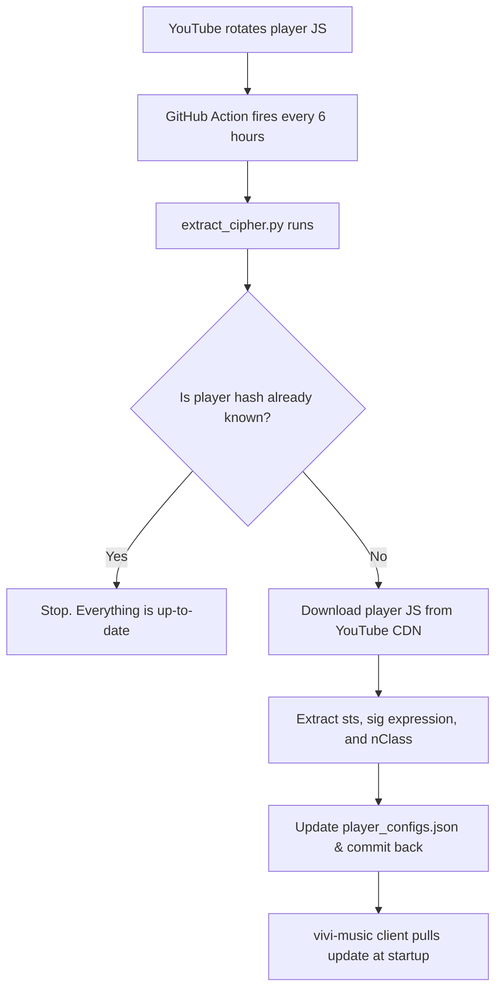

# 🪐 vivi-cipher

  
  
  
  

  **Dynamic player configurations and signature deobfuscation maps for `vivi-music` YouTube playback.**

---

## ⚡ Overview

This repository holds the dynamically updated deobfuscation parameters and throttling classes (`nClass`) for YouTube's streaming player. It enables `vivi-music` to decrypt streaming signatures and bypass playback throttling in real-time.

An automated background worker executes every 6 hours, detecting new player hashes and solving their signature algorithms so playback remains unbroken for all users.

---

## ⚙️ How it Works

---

## 📂 Repository Structure

| File | Description |
| :--- | :--- |
| **`player_configs.json`** | The database containing the signature decipher and n-transform mappings. |
| **`extract_cipher.py`** | The extraction script that downloads, parses, and updates the player signatures map. |
| **`.github/workflows/update.yml`** | The automated job that triggers the extractor on GitHub servers. |

---

## ⚠️ Proprietary Notice

> [!CAUTION]
> **Exclusive Ownership & Licensing Restrictions**
>
> This project is the **sole property of Vivi**. Unauthorized copying, redistribution, modification, hosting, or usage of this codebase, configurations, or compiled outputs in any project, via any medium, is **strictly prohibited**. 
>
> Please refer to the [LICENSE](LICENSE) file for the full terms and legal restrictions.

---

  Vivi Music Project &copy; 2026. All rights reserved.

